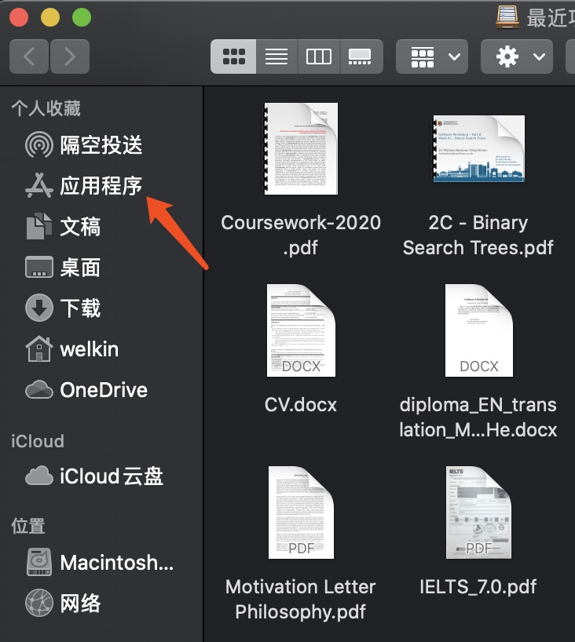
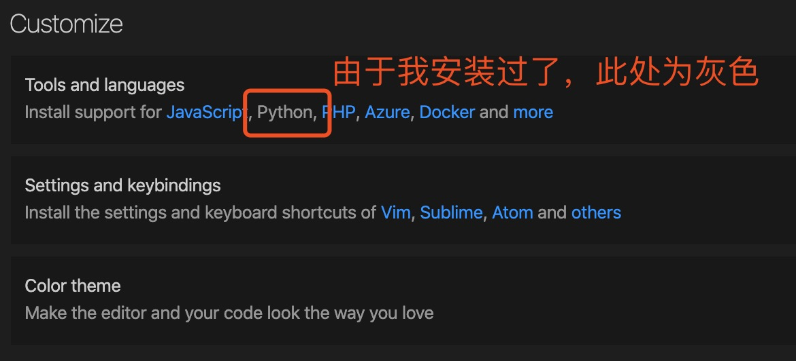
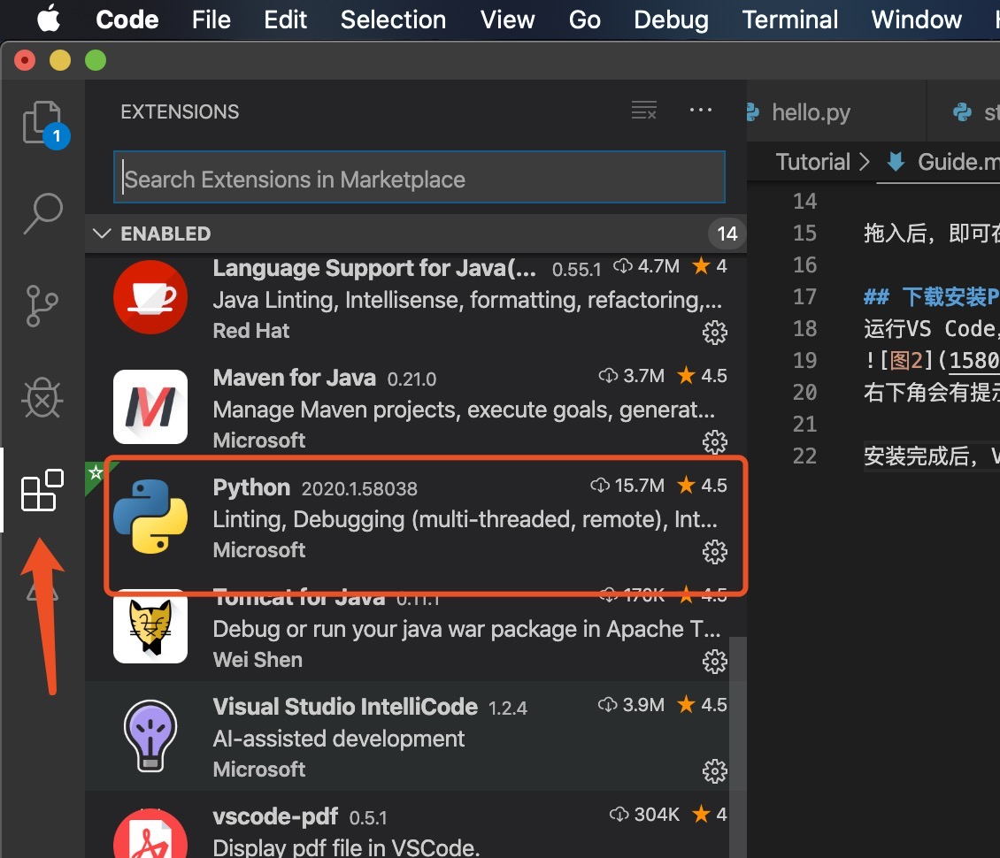

# 学习Python的第一天

任务:  
* 安装进行编写Python所需的软件和开发环境  
    1. 编写工具：Visual Studio Code  
    2. 开发环境：Python3 3.8.1 (Python.prg)    
* Hello Word首运行

## 下载安装Visual Studio Code  
进入[VS Code官网](https://code.visualstudio.com/)，点击“Downlaod for Mac(Stable Build)” 按钮下载。  

下载后得到zip压缩文件包，双击解压，得到VS Code.app。  

打开macOS中的 “访达” ，将VS Code.app拖入左侧列表的应用程序中。如

拖入后，即可在启动台中启动VS Code

## 在VS Code中安装Python扩展
运行VS Code，在欢迎界面中的Customize中，点击Python按钮.

右下角会有提示，程序将在安装完相应扩展后重启窗口，点击OK。开始安装。

安装完成后，VS Code会自动重新启动，在右侧的扩展会看到Python扩展已安装。


## 安装Python环境(Python解释器)
在[Python.org页面](https://www.python.org/downloads/)下载最新版本的Python3并安装。  

安装完成后，创建一个文件夹专门存放Python的程序，打开VS Code，依次通过File -> Open -> 打开刚才创建的文件夹。

随后，通过Terminal -> New Terminal在VS Code中打开命令行。

在命令行中，输入
```
python3 --version
```
来验证Python是否正确安装。正确安装后，会提示
```
Python 3.8.1
```

## 第一个Python程序
在VS Code打开的工作环境（文件夹）下，在文件目录下，右键 New File 创建一个名为hello.py的文件。  

注意: （在VS Code里面创建文件都需要手打后缀名。所以请完全打上名字 hello.py）

  

复制粘贴以下代码在 hello.py文件中
```python
msg = "Hello World"
print(msg)
```
保存，点击右上角的 运行 小按钮。

然后可以在下面的Terminal中查看运行结果  
